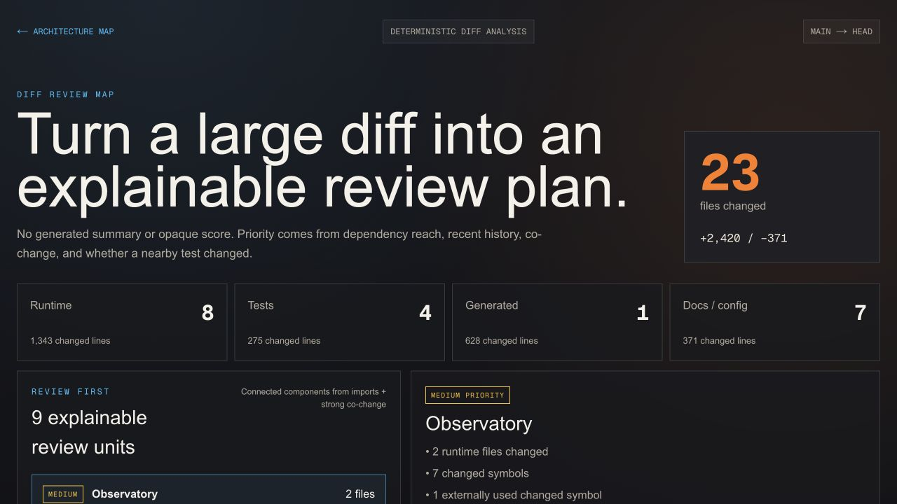

# Codebase Observatory

Understand what a code change affects before you merge it.

Codebase Observatory turns a Git diff into deterministic evidence for human
reviewers and coding agents:

```text
git diff
  -> changed symbols
  -> direct consumers and file-level dependents
  -> historical and test signals
  -> explainable review units
```

It helps answer which behavior changed, what uses it, where the blast radius is
widest, and where a nearby test change was not detected. Every priority includes
its reasons; Observatory does not produce an opaque risk score or claim that a
change is safe.



_A real Observatory development diff: 23 files and 2,791 changed lines grouped
into nine review units. This demonstrates the output, not a measured time-saving
claim._

## Install

```bash
brew install kraftaa/tap/observatory
```

No repository clone or npm installation is required.

## What It Reports

- exact files, line counts, changed ranges, and change types
- changed JavaScript and TypeScript symbols
- direct consumers and file-level downstream impact
- nearby-test change signals
- churn, coupling, ownership, and recent bug-fix evidence
- review units with explicit priority reasons

The project also includes an interactive architecture map, repository timeline,
and file biographies as supporting evidence.

## Quick Start

Open an interactive review map for uncommitted work in the current repository:

```bash
observatory review \
  --repo "$PWD" \
  --base HEAD \
  --working-tree
```

Observatory analyzes the change, starts a loopback-only local server, opens the
review map in your browser, and stops when you press `Ctrl+C`.

Generate machine-readable evidence for an agent or CI workflow:

```bash
observatory impact \
  --repo "$PWD" \
  --base HEAD \
  --working-tree \
  --json > /tmp/impact.json
```

Inspect the result:

```bash
jq '{change, summary, attention}' /tmp/impact.json
```

Working-tree mode includes staged, unstaged, deleted, renamed, and untracked
files. To analyze committed work instead, use `--base origin/main --head HEAD`.

## What Compression Looks Like

The example above starts with a mixed 23-file diff:

| Raw change | Observatory review surface |
| --- | --- |
| 2,791 changed lines across 23 files | 9 connected review units |
| Runtime, tests, generated files, and docs mixed together | 8 runtime files separated from supporting changes |
| File-level diff navigation | Changed symbols, direct consumers, and exact ranges |
| No explicit test signal | Runtime files without nearby test changes called out |

The selected unit contains two runtime files, seven changed symbols, and one
direct consumer. See the [full showcase](docs/SHOWCASE.md) for how to read it.

## Develop The Full UI

The installed `review` command contains the diff-review visualization. Clone
the project only to develop the full architecture and history UI:

```bash
npm install
npm run analyze -- /absolute/path/to/target-repository
npm run analyze-diff -- main...HEAD
npm run dev
```

The architecture view is available at `/`; the deterministic review map is at
`/review`.

## Documentation

- [Usage and command reference](docs/USAGE.md)
- [Review-map showcase](docs/SHOWCASE.md)
- [Coding-agent completion workflow](docs/AGENT_WORKFLOW.md)
- [Impact JSON schema](docs/IMPACT_SCHEMA.md)
- [Review-compression study methodology](experiments/METHODOLOGY.md)

## Current Scope

Symbol-level analysis currently targets `.js`, `.jsx`, `.ts`, and `.tsx`.
Missing static evidence is not proof of safety, test coverage, or runtime
behavior. Observatory is a review-compression aid, not a replacement for tests,
runtime validation, or reviewer judgment.

## Next Experiments

1. Measure review time and missed issues on ten real, large pull requests.
2. Validate symbols across re-exports, aliases, and barrel files.
3. Compare file-level and symbol-level blast-radius accuracy.
4. Improve test matching before adding hosted pull-request ingestion.

## License

[Apache-2.0](LICENSE)
